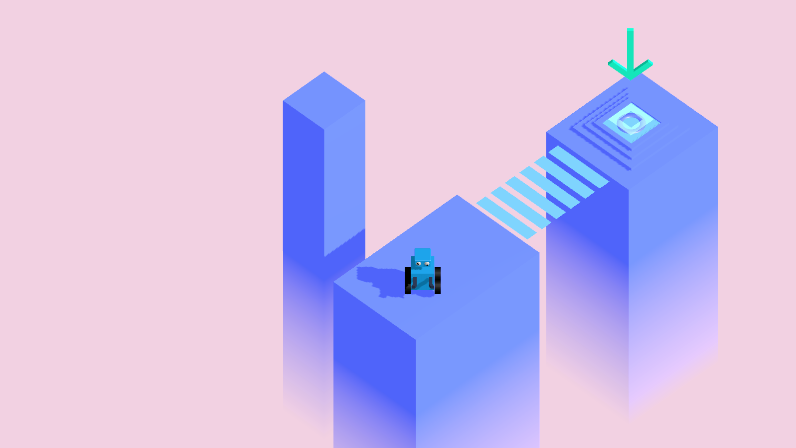
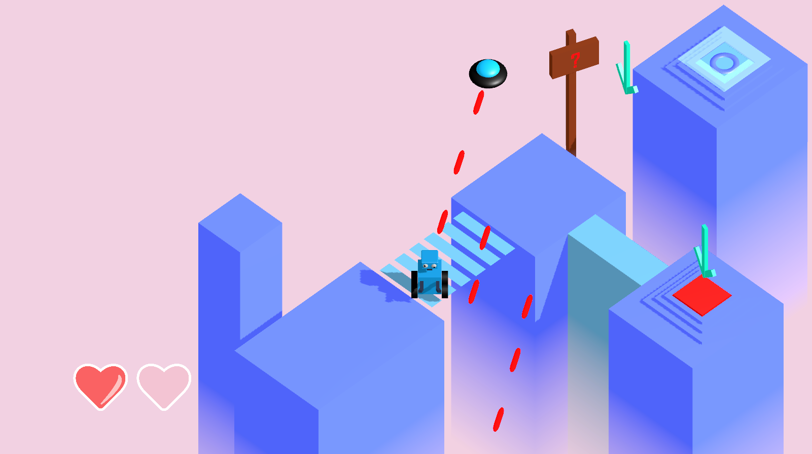
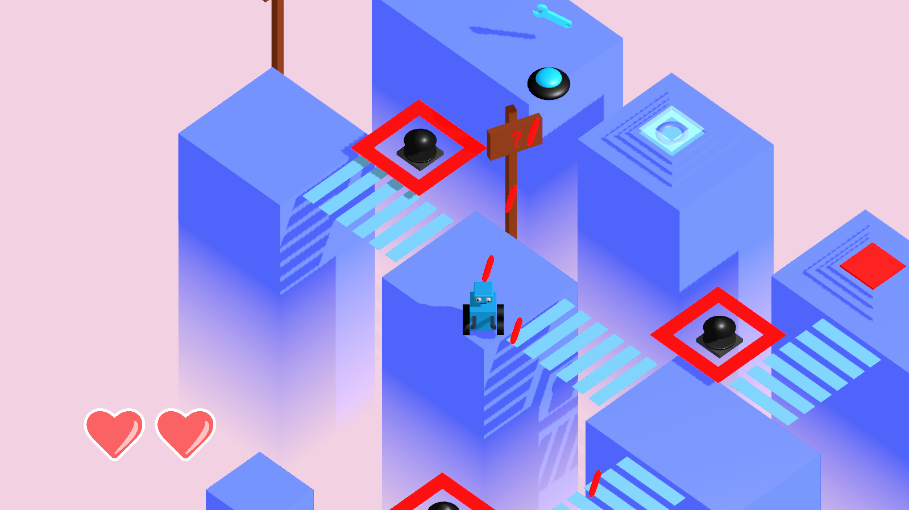
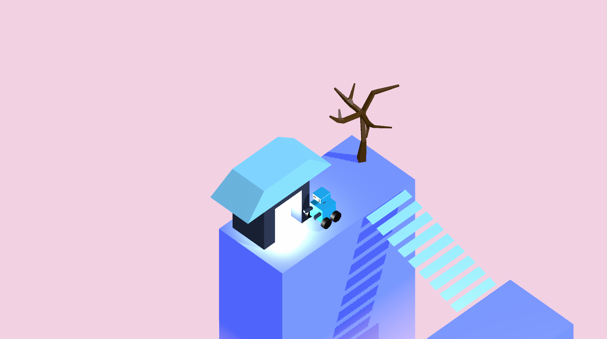

# Innovator's Jam 2021

Attacked from Above, an atmospheric isometric game with aliens 👾👽

Robots, aliens, lasers, two ends, and fun. Play it now one the itch.io page below or download it for windows

---

See this game's [itch.io page](https://andrewli.itch.io/attacked-from-above)

For the Innovator's Game Jam (see below) 

See [itch.io page](https://itch.io/jam/ij2021)

## Screenshots 🎥

## Resources 📚

Fog effect from [lmhpoly.com](https://www.lmhpoly.com/tutorials/unity-urp-tutorial-orthographic-fog-plane-shader)

Sound Effect: [sfbgames.itch.io/chiptone](https://sfbgames.itch.io/chiptone)